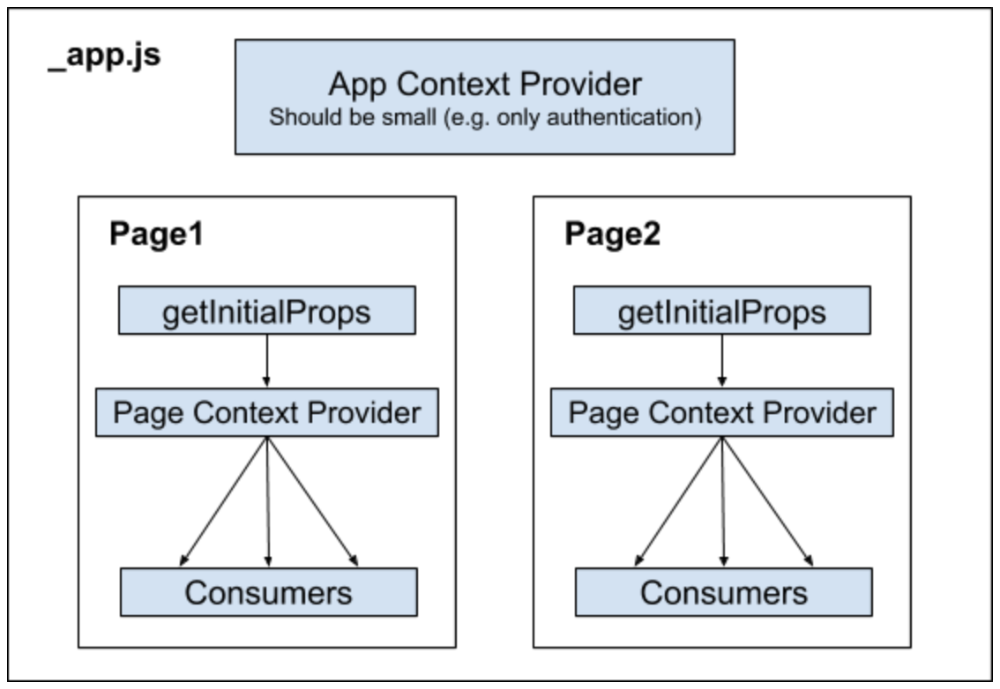

# next-state-manager example app

## What is it?

This is not (yet) a library. It's a state management pattern for NextJS; it uses mutliple stores and is built on the React Context API.

## Why for NextJS?

Whilst this pattern can be used in any React application, it works particularly well with NextJS because:

1. Often there is no need to share state between pages\* in NextJS, and so it makes sense to give each page its own store
2. The props returned from a page's `getInitialProps` method (for example data fetched from an API) can easily be injected into the store for the given page

\*pages meaning each component within the pages directory, i.e. a route of the application

## Architecture



Most of the logic lives in the Context Provider function where the props from `getInitialProps` are merged into the initial state:

```
const ContextProvider = ({ children, initialProps }) => {
  const initFunction = () => ({ ...initialState, ...initialProps })
  const [state, dispatch] = useReducer(
    coffeePageReducer,
    initialState,
    initFunction
  )

  return (
    <StateContext.Provider value={state}>
      <DispatchContext.Provider value={dispatch}>
        {children}
      </DispatchContext.Provider>
    </StateContext.Provider>
  )
}
```

## What patterns are used?

- Actions & reducers with the `useReducer` hook
- [Immer](https://github.com/immerjs/immer) for immutable state updates
- Action creators; these automatically get wrapped with `dispatch` so you can use these rather than dispatching directly from in the component

## What is it missing?

Comparing to Redux is the easiest way to explain what's missing. Redux is optimized to reduce unecessary re-renders of components connected to the store - the component will only update if the _specific part of the state_ that it cares about has changed, where this part of state is defined by `mapStateToProps`.

The Context API does not offer this choice to re-render for only some state updates; if any part of a Provider's context value changes, then all Consumers of this context will update. [See this RFC](https://github.com/reactjs/rfcs/pull/119) for some proposed solutions.

However, this state architecture is based on having multiple stores meaning that each store should be _relatively_ small which would reduce the extent of this unecessary re-rendering.

## Three ways to 'use' context

Need to consider which is the preferrable way to bring pieces of state and/or certain actions into a component.

For example, if you need the list of coffee shops and the action to mark one as visited.

1. Destructure the specific state and action on the way in:

```
const {
  state: { coffeeShops },
  actions: { toggleVisitedShop },
} = useCoffeeContext()
```

2. Redux-like `mapStateToProps` and `mapDispatchToProps` as arguments to our `useCoffeeContext` hook. Let's call them `takeState` and `takeActions`:

```
const takeState = state => ({ coffeeShops: state.coffeeShops })
const takeActions = actions => ({ toggleVisitedShop: actions.toggleVisitedShop })

const { coffeeShops, toggleVisitedShop } = useCoffeeContext(takeState, takeActions)
```

3. Go full-Redux and make our useContext a higher-order component:

```
import { toggleVisitedShop } from './actions'
...
const takeState = state => ({ coffeeShops: state.coffeeShops })
const takeActions = { toggleVisitedShop }
...

export default withCoffeeContext(takeState, takeActions)(CoffeeList)
```

Note that even though options 2 and 3 look a bit like Redux, they do not provide the same optimizations (see section above).
